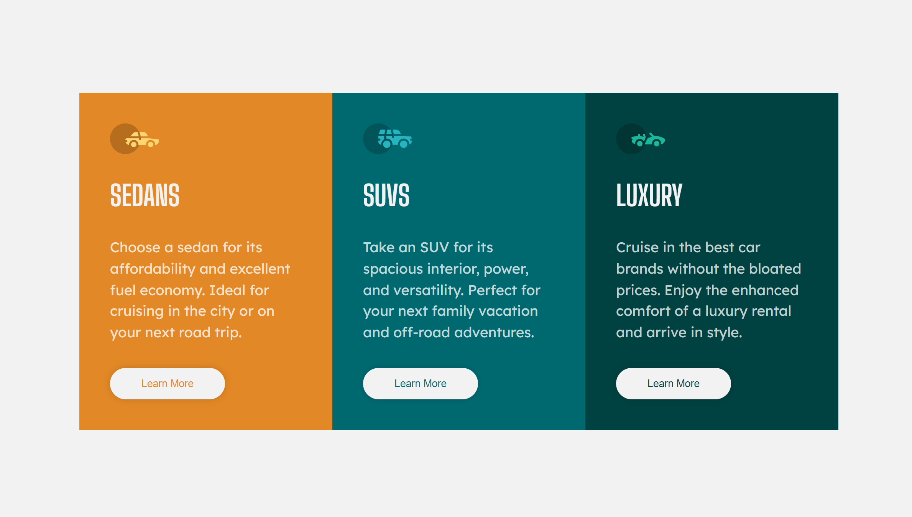

# 3-column preview card component - React cards

This is a solution to the [3-column preview card component challenge on Frontend Mentor](https://www.frontendmentor.io/challenges/3column-preview-card-component-pH92eAR2-). Frontend Mentor challenges help you improve your coding skills by building realistic projects. 

## Table of contents

- [Overview](#overview)
  - [The challenge](#the-challenge)
  - [Screenshot](#screenshot)
  - [Links](#links)
- [My process](#my-process)
  - [Built with](#built-with)
  - [What I learned](#what-i-learned)
  - [Useful resources](#useful-resources)
- [Author](#author)

## Overview

### The challenge

Users should be able to:

- View the optimal layout depending on their device's screen size
- See hover states for interactive elements

### Screenshot

### Links

- Live Site URL: [React cards using styled components](https://react-cards-3.netlify.app/)

## My process

### Built with

- Mobile-first workflow
- [React](https://reactjs.org/) - JS library
- [Styled Components](https://styled-components.com/) - For styles

### What I learned

- how to use styled components
- apply Global styles from styled-components
- how to render cards using data content
- passing props to see hover states for interactive elements

### Useful resources

- [Traversy Media Tutorial](https://youtu.be/02zO0hZmwnw) - This is a styled components crash course with a project example.

## Author

- Github - [Codernami](https://github.com/codernami)
- Frontend Mentor - [@codernami](https://www.frontendmentor.io/profile/codernami)
